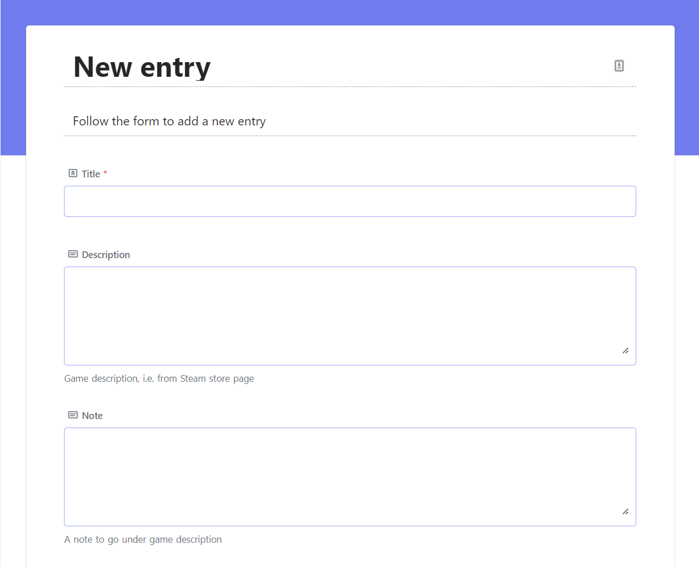

# EduGameDist (<a href="https://vaagenim.github.io/spill.iktim.no/">Old demo</a>)
[](https://github.com/sondregronas/EduGameDist/)
[](https://github.com/sondregronas/EduGameDist/commit/)

A containerized web based game distribution solution for educational settings. Requires access to the schools local network in order to work. You should never expose this to the internet, as it is illegal to distribute games without permission. Ensure only local devices and students can access the server.

Note: Parts of this project is in Norwegian, as it was made for a Norwegian school, you can change this by editing the `.pug` files in the `views` folder by uncommenting the volume mount in the `docker-compose.yml` file.

## What is this?
Traditionally games have been distributed on physical media. This is a problem for schools, as they have to buy a lot of physical media, and it is hard to keep track of who has what. This project aims to solve this problem by providing a way to distribute games over a local network.

For information on how to get access to distribution friendly games, see [this article by spillpedagogene (Norwegian)](https://www.spillpedagogene.no/2016/12/06/spill-i-skolen-innkjop-og-logistikk/).

## Usage
Default username: `admin@change.me`
Default password: `changeme`

Be sure to create a new superuser and change the password.

The project is preconfigured with 3 different views for NocoDB (`localhost:8080`): 
- `Games` (Grid)
- `Friendly` (Gallery view) 
- `New entry` (Form)



The `New entry` form should be used to add new games to the database. The `Friendly` view should be used to add information about the games.

I recommend giving access to the `Friendly` view to those who should be able to edit information on the games.

## Setup
Create a `docker-compose.yml`:
```yaml
version: "3.3"
services:
  frontend:
    image: ghcr.io/sondregronas/edugamedist
    restart: unless-stopped
    ports:
      - "80:80"
    volumes:
      - ./games:/app/public/games
      - ./cfg:/app/public/cfg
      - ./db:/app/db
      - ./db/nc/uploads/noco/Games/Games/Cover:/app/public/img

      # Choose between only a few select view-files, or the entire view folder.
      - ./cfg:/app/views/cfg
      # - ./cfg/views:/app/views

      # Uncomment for full CSS access
      # - ./cfg/css:/app/public/css

      # Uncomment for full access (not recommended)
      # - ./app:/app
  db:
    image: nocodb/nocodb
    restart: unless-stopped
    ports:
      - "8080:8080"
    volumes:
      - ./db:/usr/app/data/
```

Run using `docker-compose up -d`.

Modify the generated `nav.pug` (Navigation buttons), `variables.pug` (HTML Title) and `header.pug` (Index text) in the `cfg` folder to your liking. Note that a restart is required for changes to take effect (for `.pug` files only).

## Recommended setup
Use in conjunction with [NginxProxyManager](https://nginxproxymanager.com/) to get a nice URL for both the frontend and database. Be sure to restrict access to the server to only your local network for the frontend, as games will be accessible from the frontend.

## Development
Clone the repo and set your working directory to `src`.<br>
Install dependencies using `npm i`.<br>
The dev-mode can be activated by running `npm run dev`, which will automatically refresh the server when changes are made.<br>

The database is based on SQLite, and can be accessed using the [NocoDB](https://github.com/nocodb/nocodb) frontend (`localhost:8080`).

## License
This project is licensed under the MIT License - see the [LICENSE](LICENSE) file for details
