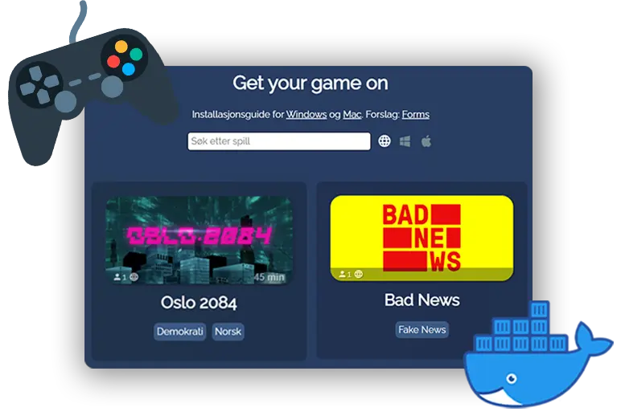
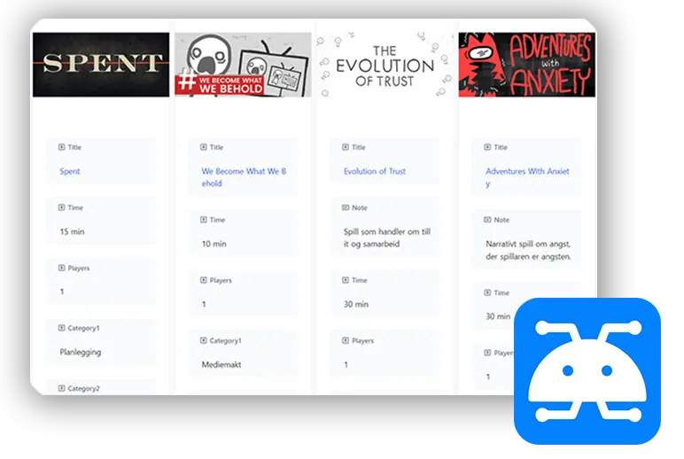

# 🕹️ Game Distribution for Schools 🏫

Simple game distribution for schools, dockerized and ready to deploy.
 [Click here for a demo.](https://sondregronas.github.io/EduGameDist/)

> **Note:** Parts of this project is in Norwegian, as it was made for a Norwegian school, to adjust this you must modify all `.pug` files in the `views` folder by uncommenting the volume mount in the `docker-compose.yml` file.

## Disclaimer
While this project allows for managing distribution of games or any files over the internet, it's only intended for local and internal use. Take additional precautions to ensure the service is only accessible to those eligible by law in your area. Deploy at your own risk.

## Installation
Please refer to the [documentation](https://sondregronas.github.io/EduGameDist/docs) on [how to install](https://sondregronas.github.io/EduGameDist/docs/Installation/docker/) and [use](https://sondregronas.github.io/EduGameDist/docs/Usage/Adding-games/) this project.

## Educator friendly NocoDB Backend
The backend is powered by [NocoDB](https://nocodb.com/), a simple and easy to use database management tool. [Click here for a preview.](https://sondregronas.github.io/EduGameDist/docs/Gallery/Nocodb/)

## Contributing
Feel free to contribute in any way you see fit. If you have questions, suggestions or ideas, please open an issue.

You can read more on how you can contribute in the [documentation](https://sondregronas.github.io/EduGameDist/docs/Contributing/).

## License
This project is licensed under the MIT License - see the [LICENSE](LICENSE) file for details
