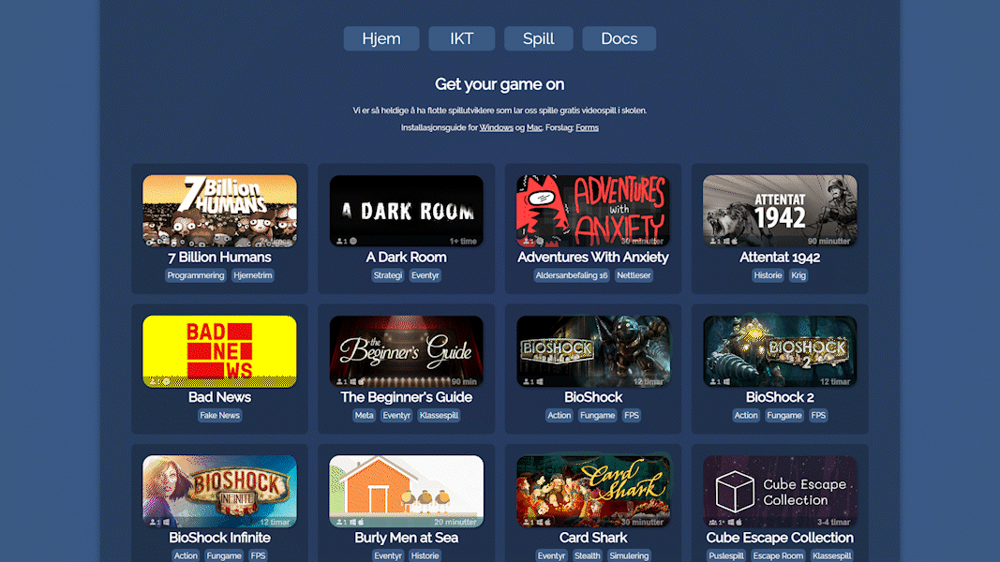
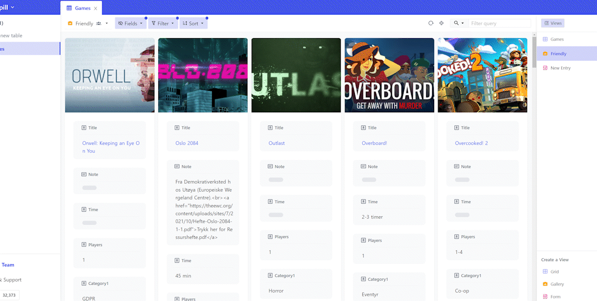

# EduGameDist (<a href="https://sondregronas.github.io/EduGameDist/">Demo</a>)

Simple game distribution for schools. Dockerized and ready to deploy.

> **Note:** Parts of this project is in Norwegian, as it was made for a Norwegian school, you may need to modify all `.pug` files in the `views` folder by uncommenting the volume mount in the `docker-compose.yml` file. This will allow you to edit the files directly on your host machine, and the changes will be reflected in the container.

Please refer to the [documentation](https://sondregronas.github.io/EduGameDist/docs) for how to install and use this project.

## Disclaimer
While this project allows for managing distribution of games or any files over the internet, it's only intended for local and internal use. Take additional precautions to ensure the service is only accessible to those eligible by law in your area. Deploy at your own risk.

## Simple NocoDB Backend
The backend is powered by [NocoDB](https://nocodb.com/), a simple and easy to use database management tool.

## Contributing
Refer to [CONTRIBUTING.md](CONTRIBUTING.md) for more information.

## License
This project is licensed under the MIT License - see the [LICENSE](LICENSE) file for details
