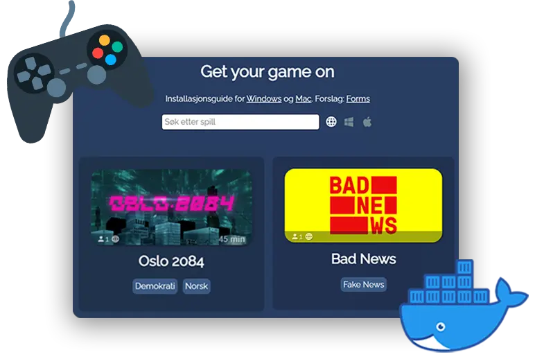

<div align="center">

# 🕹️ Game Distribution for Schools 🏫
[](https://sondregronas.github.io/EduGameDist/)
[](https://sondregronas.github.io/EduGameDist/docs)
[](https://github.com/sondregronas/EduGameDist/)
[](https://github.com/sondregronas/EduGameDist/commit/)

En enkel, Docker-basert spilldistribusjon for skoler.
<br>[Se demoen.](https://sondregronas.github.io/EduGameDist/)



</div>

> **Ansvarsfraskrivelse:** Prosjektet er ment for lokal og intern bruk. Pass på at bare personer som har rett til det, får tilgang til nettsiden og filene. Kontroller distribusjonsrettigheter og lokale regler før bruk.

> **Om bruk av KI:** Store deler av dette prosjektet er utviklet med hjelp av KI (GitHub Copilot). Vurder koden selv før du tar den i bruk i din organisasjon.

## Funksjoner

- **To apper:** en offentlig, skrivebeskyttet nettside og en egen administrasjonsapp, som deler samme database og filer.
- **Redigering direkte på siden:** admin ser ut som den offentlige siden, men med en **Rediger**-knapp. Tekst, kategorier, lenker og filer endres der du ser dem.
- **Flere filer per plattform** (Windows, Mac, Linux, Android) og lenke til nettleserspill. Filer lastes opp i én forespørsel og lagres uendret, uten størrelsesgrense i appen.
- **Import fra Steam:** tittel, beskrivelse, utvikler og omslagsbilde (lastes ned og lagres lokalt). GOG-, itch.io- og Humble-lenker søkes opp automatisk.
- **Passordbeskyttet admin** med en enkel innloggingsside.
- Eksisterende NocoDB-data migreres automatisk ved første oppstart.

## Installasjon

Start tjenestene fra mappen med `docker-compose.yml`:

```bash
ADMIN_PASSWORD=velg-et-passord docker compose up -d
```

- Den offentlige nettsiden er tilgjengelig på port 80.
- Admin publiseres **ikke** på en vertsport. Den ligger på Docker-nettverket `edugamedist_proxy_access`; koble Nginx Proxy Manager (NPM) til nettverket og opprett en proxy host til `admin:8081`.
- Begrens tilgangen til både admin og den offentlige siden med NPM Access List eller brannmur etter behov. Alle som når den offentlige siden kan laste ned spillene.

Se [installasjonsdokumentasjonen](https://sondregronas.github.io/EduGameDist/docs/Installation/docker/) for proxy-, tilgangs- og opplastingsoppsett.

## Lokal utvikling

Med [uv](https://docs.astral.sh/uv/) installert, start begge appene med live-reload fra prosjektroten:

```powershell
uv sync; if ($?) { uv run --directory src python dev.py }
```

Dette er PowerShell-kommandoen. I bash eller zsh bruker du `uv sync && uv run --directory src python dev.py`. Admin kjører på <http://localhost:8081> og den offentlige siden på <http://localhost:8080>. Se [utviklerdokumentasjonen](https://sondregronas.github.io/EduGameDist/docs/Contributing/) for detaljer. Bidrag og forslag er velkomne.

## Lisens

Prosjektet bruker MIT-lisensen. Se [LICENSE](LICENSE). Ikonene er hentet fra [Material Design Icons](https://pictogrammers.com/library/mdi/) (Apache-2.0) og [Simple Icons](https://simpleicons.org/) (CC0).