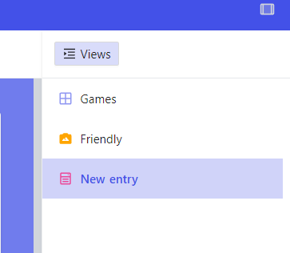

# Adding games
To add a game, login to the backend and click on the `Games` table within the `Games` database. On the right side of the screen, click on the `New entry` button to add a new game. Fill out the fields and click `Submit`.

The game will be available on the frontend within 15 minutes.

## Fields
- [ ] **Title**: The title of the game.
- [ ] **Description**: A short description of the game, i.e. from the Steam store page.
- [ ] **Note**: A note that will be displayed on the game page, from the teacher. Supports unescaped HTML in order to add links or other formatting.
- [ ] **Cover**: The cover image of the game. Recommended size is 460x215 pixels, which is the default size of the cover image on the Steam store page.
- [ ] **Time**: The time it takes to play the game (i.e. `10 min` or `1 hour`).
- [ ] **Players**: The number of players (i.e. `1` or `2-4`).
- [ ] **Category**: The categories of the game (i.e. `Action` or `Adventure`).
- [ ] **Developer**: The developer of the game.
- [ ] **Developer Link**: The website of the developer.
- [ ] **Url**: The URL to a browser version of the game.
- [ ] **Windows_dl**: The filename (or URL) (preferably a zip file) of the Windows version of the game, located in the `games/Windows` folder.
- [ ] **Mac_dl**: The filename (or URL) (preferably a zip file) of the Mac version of the game, located in the `games/Mac` folder.
- [ ] **Linux_dl**: The filename (or URL) (preferably a zip file) of the Linux version of the game, located in the `games/Linux` folder.
- [ ] **Android_dl**: The filename (or URL) (preferably a zip file) of the Android version of the game, located in the `games/Android` folder.
- [ ] **Store**: The store(s) where the game can be purchased (i.e. `Steam` or `Epic Games Store`).

> [!NOTE]+ 
> The `Note` column allows for unescaped HTML, which allows inputting relevant links or additional files. For example:
> `<a href="games/Windows/MyGame-DLC.zip">DLC</a>` or `<a href="https://<external-site>.pdf">PDF Manual</a>`.
>
> Should you wish to disable this behavior, simply omit the `!` symbol from `p.game-note!=gameData['note']` in [game.pug](https://github.com/sondregronas/EduGameDist/blob/main/src/views/game.pug#L17)